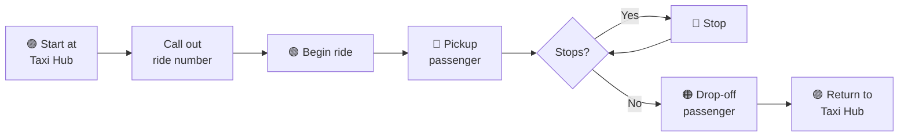

# Physical Stage Competition Guide

> **Stages 2 & 3 | In-Person at ACC 2026**

Finalists from the Virtual Stage will implement their self-driving algorithm on **physical QCar 2** vehicles and compete live at the American Control Conference.

---

## 🎯 Objective

**Maximize money earned** by completing taxi rides within a time limit.

Teams will receive a file with **coordinates and ride details** on competition day. Rides can have **multiple stops**, with more complex rides earning more money.

---

## 🚕 Ride Sequence

Each ride follows this sequence:



### Step-by-Step

1. **Start** - QCar 2 in Taxi Hub Area with **Magenta** LEDs
2. **Announce** - Write down/call out the ride number, show judges
3. **Confirmation** - Wait for judge confirmation, change LEDs to **Green**
4. **Navigate to Pickup** - Drive to pickup coordinates
5. **Pickup** - Full stop + **Blue** LEDs
6. **Stops** (if any) - Full stop + **Red** LEDs at each stop
7. **Drop-off** - Full stop + **Orange** LEDs at final destination
8. **Return** - Navigate to Taxi Hub, full stop + **Magenta** LEDs

---

## 🎨 LED Color Protocol

| Color | Meaning |
|-------|---------|
| 🟣 **Magenta** | Waiting at Taxi Hub / Ride complete |
| 🟢 **Green** | En route to pickup / In transit |
| 🔵 **Blue** | Passenger pickup |
| 🔴 **Red** | Intermediate stop |
| 🟠 **Orange** | Passenger drop-off |

> [!WARNING]
> Failure to use correct LED colors will result in rating deductions!

---

## ⭐ Ride Ratings

Each ride starts with **5 stars**. Stars are deducted for infractions:

| Infraction | Impact |
|------------|--------|
| Crossing lane lines | Star deduction |
| Not fully stopping at traffic controls | Star deduction |
| Slow reaction to traffic controls | Star deduction |
| Wrong LED color | Star deduction |
| Not stopping at pickup/drop-off | Star deduction |

> [!NOTE]
> Judges use their discretion for timing and distances. All judge decisions are **final** unless overruled by another judge.

---

## 💰 Scoring System

Each ride has a **dollar value** based on complexity. Final score is calculated as:

```
Ride Value × Rating = Total Money Earned
```

### Example Scoring

| Ride | Value | Rating | Total Earned |
|------|-------|--------|--------------|
| Ride 1 (simple) | $10 | 5⭐ | $50 |
| Ride 2 (complex) | $25 | 4⭐ | $100 |
| Ride 3 (multi-stop) | $40 | 3⭐ | $120 |
| **Total** | | | **$270** |

> [!TIP]
> A ride can be completed multiple times. Only the **best rating** for each ride contributes to your final score.

---

## 🔄 Restart Rules

- If you want to **restart** a ride → Pick up QCar 2, place in Taxi Hub
- **Any touch** of the QCar 2 disqualifies that ride attempt
- You must restart from the Taxi Hub

---

## 📍 Competition Coordinates

All coordinates use the same system as QLabs (1:1 representation).

**Base Frame**: `[0, 0, 0]` defined by the coordinate tool in QLabs

See [[Coordinate-System]] for details.

---

## 📋 Competition Day Checklist

Bring to the venue:
- [ ] Visas to USA
- [ ] Travel arrangements confirmed
- [ ] Hotel accommodations
- [ ] Router (for QCar connectivity)
- [ ] Network Switch
- [ ] Development laptops
- [ ] Portable monitors
- [ ] Extension cords
- [ ] Keyboards and mice

See [[Checklist]] for complete details.

---

## 🔗 Related Documents

- [[Scoring-System]] - Detailed scoring breakdown
- [[LED-Protocol]] - LED color meanings
- [[Coordinate-System]] - Competition coordinate system
- [[Checklist]] - Competition day checklist
- [[Networking]] - Network setup guide

---

## 📚 External Resources

- [Physical Stage Competition Guide](https://quanser.github.io/student-competitions/events/common/Rules_and_Objectives/Physical_Stage_Competition_Guide.html)
- [Competition Day Guide](https://quanser.github.io/student-competitions/events/common/Rules_and_Objectives/Physical_Stage_Competition_Day_Guide.html)
