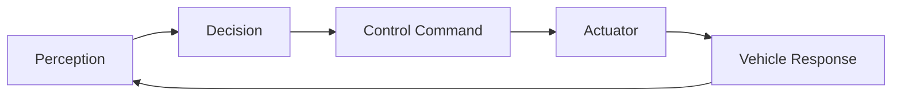

# Core Principles of Self-Driving

These are the fundamental principles that judges evaluate in your self-driving algorithm.

---

## 🎯 Overview

A successful self-driving algorithm must demonstrate competence in **four core areas**:

1. **Data Collection** - Gathering sensor information
2. **Interpretation** - Understanding the environment
3. **Control Systems** - Executing driving actions
4. **Localization & Path Planning** - Navigation

---

## 📡 1. Data Collection

> A Self-Driving algorithm must be able to **collect and filter information** from interoceptive and exteroceptive sensors.

### Key Aspects

| Sensor Type | Examples | Purpose |
|-------------|----------|---------|
| **Exteroceptive** | Cameras, LiDAR | External environment perception |
| **Interoceptive** | IMU, encoders | Internal state monitoring |

### What to Demonstrate

- Raw data acquisition from sensors
- Noise filtering and processing
- Conversion to meaningful information
- Real-time data handling

### Example Implementation

```
Camera → Raw Image → Lane Detection → Lane Position Data
LiDAR → Point Cloud → Obstacle Detection → Distance/Position Data
```

---

## 🧠 2. Interpretation

> Using system-relevant data, a Self-Driving car must **correlate gathered information** to factors happening internally or externally.

### External Factors

| Factor | Description |
|--------|-------------|
| **Traffic Signs** | Stop signs, speed limits, yield |
| **Traffic Lights** | Red, yellow, green detection |
| **Pedestrians** | Detection and tracking |
| **Other Vehicles** | Detection and behavior prediction |

### Internal Factors

| Factor | Description |
|--------|-------------|
| **Battery Monitoring** | Power management |
| **System State** | Current mode, health status |
| **Sensor Health** | Sensor functionality |

### What to Demonstrate

- Object classification
- State inference
- Decision context building
- Real-time interpretation

---

## 🎮 3. Control Systems

> From viable options determined in interpretation, the car must **execute accurately** on the chosen option.

### Key Capabilities

| Capability | Description |
|------------|-------------|
| **Lane Keeping** | Staying within lane lines |
| **Turn Execution** | Smooth, accurate turns |
| **Stop Control** | Full stops at traffic controls |
| **Obstacle Avoidance** | Path adjustment for obstacles |
| **Speed Management** | Maintaining desired speed |

### Control Loop



### What to Demonstrate

- Smooth steering control
- Proper acceleration/braking
- Accurate stop positioning
- Reactive obstacle avoidance

---

## 🗺️ 4. Localization and Path Planning

> For a car to arrive at locations, it must understand **where it is** within the roadmap.

### Key Components

| Component | Description |
|-----------|-------------|
| **Localization** | Determining position in map |
| **Mapping** | Storing local/global map |
| **Path Planning** | Route from A to B |
| **Path Adjustment** | Dynamic route changes |

### What to Demonstrate

- Knowledge of position in coordinate system
- Route calculation to destinations
- Dynamic re-routing capability
- Handling of:
  - Vehicles on the road
  - Road obstructions
  - Pedestrians entering/leaving

---

## 📊 Evaluation Criteria

Judges evaluate your algorithm based on:

| Criterion | Weight | Description |
|-----------|--------|-------------|
| **Readiness** | High | Core principles implementation |
| **Accuracy** | High | Staying within lanes |
| **Timing** | Medium | Reaction to traffic controls |
| **Communication** | High | Explaining your concepts |

> [!IMPORTANT]
> The **communication** criterion is crucial! Judges want to see that you understand these principles deeply.

---

## 💡 Tips for Success

### In Your Video
- Clearly explain each principle you implement
- Show visual overlays of perception
- Demonstrate decision-making process
- Highlight unique algorithm features

### In Your Code
- Modular architecture for each principle
- Clear documentation
- Testable components
- Robust error handling

---

## 🔗 Related Documents

- [[Virtual-Stage-Guide]] - Video submission requirements
- [[Physical-Stage-Guide]] - Physical competition details
- [[Detailed-Scenario]] - Practice scenario

---

## 📚 External Resources

- [Virtual Stage Competition Guide](https://quanser.github.io/student-competitions/events/common/Rules_and_Objectives/Virtual_Stage_Competition_Guide.html#core-principles-of-self-driving)
- [Czech Technical University Example](https://www.youtube.com/watch?v=JXOI1RtLTbs)
