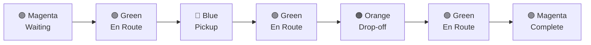

# Detailed Scenario

This is the official scenario for the Virtual Stage video submission and Physical Stage practice.

---

## 🎥 Video Reference

The detailed scenario is demonstrated in [this official video](https://youtu.be/NtgBwlfGbMc).

---

## 📋 Scenario Overview

This scenario represents a **single taxi ride** that you must demonstrate:

1. Start at Taxi Hub
2. Pick up passenger
3. Drop off passenger
4. Return to Taxi Hub

---

## 🚕 Step-by-Step Sequence

### Step 1: Initialize
Run the `Setup_Real_Scenario` file:
- **Python**: `Setup_Real_Scenario.py`
- **MATLAB**: `Setup_Real_Scenario.m`

This spawns the QCar 2 in the **Taxi Hub Area**.

### Step 2: Standby Mode
Change the LED strip to **🟣 Magenta** to indicate waiting.

### Step 3: Begin Ride
Change LEDs to **🟢 Green** and navigate to the **pickup coordinate**:

```
Pickup: [0.125, 4.395] (meters)
```

### Step 4: Pickup Passenger
- Come to a **full stop**
- Change LED strip to **🔵 Blue**

### Step 5: Navigate to Drop-off
Drive to the **drop-off coordinate**:

```
Drop-off: [-0.905, 0.800] (meters)
```

### Step 6: Drop-off Passenger
- Come to a **full stop**
- Change LED strip to **🟠 Orange**

### Step 7: Return to Hub
Navigate back to the **Taxi Hub Area** and change LED strip to **🟣 Magenta**.

---

## 🎨 LED Sequence Summary



---

## 👀 Judge Expectations

When viewing video submissions, judges watch for:

| Aspect | Expectation |
|--------|-------------|
| **Lane Keeping** | Cars NOT crossing lane lines |
| **Stop Compliance** | Full stops at traffic controls |
| **Timing** | Timely reactions to traffic controls |
| **Passenger Handling** | Proper pickup/drop-off stops |
| **Obstacle Avoidance** | Avoiding any obstacles |
| **Speed** | Moving efficiently (important for physical stage) |
| **LED Colors** | Correct colors at each phase |

---

## ⚠️ Important Notes

> [!CAUTION]
> Teams are NOT allowed to use the `qvl` library to move or gather information from the QCar 2. Doing so will **invalidate** your submission.

> [!NOTE]
> This scenario only represents a **single ride**. The physical stage requires completing **as many rides as possible** in the time limit.

---

## 💡 Making It More Complex

While the basic scenario is required, teams are encouraged to:

1. **Add traffic actors** - Other vehicles on the road
2. **Include pedestrians** - Test pedestrian detection
3. **Create obstacles** - Test avoidance capabilities
4. **Add intersections** - Multiple traffic lights/signs
5. **Weather/lighting** - Different visibility conditions

> [!TIP]
> More complex scenarios better showcase your algorithm's capabilities!

---

## 🔗 Related Documents

- [[Virtual-Stage-Guide]] - Video submission requirements
- [[LED-Protocol]] - Complete LED color meanings
- [[Coordinate-System]] - Coordinate system details
- [[Physical-Stage-Guide]] - Physical stage with multiple rides

---

## 📚 External Resources

- [Detailed Scenario Page](https://quanser.github.io/student-competitions/events/common/Rules_and_Objectives/Virtual_Detailed_Scenario.html)
- [Scenario Video](https://youtu.be/NtgBwlfGbMc)
- [Setup Files - Python](https://quanser.github.io/student-competitions/events/common/Virtual_ROS_Resources/env_setup/docker_resources/quanser_docker/python/Base_Scenarios_Python/Setup_Real_Scenario.py)
- [Setup Files - MATLAB](https://quanser.github.io/student-competitions/events/common/Virtual_MATLAB_Resources/self_driving_stack_resources/Setup_Real_Scenario.m)
