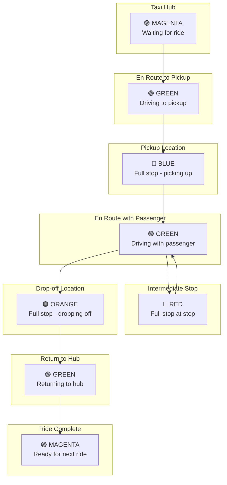

# LED Protocol

The QCar 2 LED strip communicates the vehicle's status to judges and observers.

---

## 🎨 Color Reference

| Color | Meaning | When to Use |
|-------|---------|-------------|
| 🟣 **Magenta** | Waiting/Ride Complete | At Taxi Hub, awaiting or completing ride |
| 🟢 **Green** | En Route/In Transit | Driving to pickup, drop-off, or hub |
| 🔵 **Blue** | Passenger Pickup | Stopped at pickup location |
| 🔴 **Red** | Intermediate Stop | Stopped at a stop (multi-stop rides) |
| 🟠 **Orange** | Passenger Drop-off | Stopped at drop-off location |

---

## 📍 Usage Diagram



---

## 🚕 Single Ride Sequence

### Simple Ride (Pickup → Drop-off)

| Step | Location | LED Color |
|------|----------|-----------|
| 1 | Taxi Hub (waiting) | 🟣 Magenta |
| 2 | Driving to pickup | 🟢 Green |
| 3 | At pickup (stopped) | 🔵 Blue |
| 4 | Driving to drop-off | 🟢 Green |
| 5 | At drop-off (stopped) | 🟠 Orange |
| 6 | Driving to hub | 🟢 Green |
| 7 | At Taxi Hub (complete) | 🟣 Magenta |

### Multi-Stop Ride

| Step | Location | LED Color |
|------|----------|-----------|
| 1 | Taxi Hub (waiting) | 🟣 Magenta |
| 2 | Driving to pickup | 🟢 Green |
| 3 | At pickup (stopped) | 🔵 Blue |
| 4 | Driving to stop 1 | 🟢 Green |
| 5 | At stop 1 (stopped) | 🔴 Red |
| 6 | Driving to stop 2 | 🟢 Green |
| 7 | At stop 2 (stopped) | 🔴 Red |
| 8 | Driving to drop-off | 🟢 Green |
| 9 | At drop-off (stopped) | 🟠 Orange |
| 10 | Driving to hub | 🟢 Green |
| 11 | At Taxi Hub (complete) | 🟣 Magenta |

---

## ⚠️ Common Mistakes

> [!WARNING]
> Wrong LED colors result in **star deductions** from your ride rating!

### Mistakes to Avoid

| Mistake | Correct Action |
|---------|---------------|
| Forgetting to change color | Always update on state change |
| Wrong color for action | Memorize the protocol |
| Late color change | Change immediately when stopped |
| Keeping green at stop | Must show blue/red/orange |

---

## 💻 Implementation Tips

### Code Structure

```python
# Example LED control states
LED_WAITING = "MAGENTA"    # At hub, waiting
LED_TRANSIT = "GREEN"      # Driving
LED_PICKUP = "BLUE"        # At pickup location
LED_STOP = "RED"           # At intermediate stop
LED_DROPOFF = "ORANGE"     # At drop-off location

def update_led(state):
    """Update QCar 2 LED strip to specified color"""
    # Your LED control implementation
    pass
```

### State Machine

Consider implementing a state machine:

```python
class RideState:
    WAITING = 0
    EN_ROUTE_PICKUP = 1
    AT_PICKUP = 2
    EN_ROUTE_STOP = 3
    AT_STOP = 4
    EN_ROUTE_DROPOFF = 5
    AT_DROPOFF = 6
    RETURNING = 7
    COMPLETE = 8
```

---

## 🔗 Related Documents

- [[Detailed-Scenario]] - Complete scenario walkthrough
- [[Physical-Stage-Guide]] - Physical stage rules
- [[Scoring-System]] - Rating deductions

---

## 📚 External Resources

- [Physical Stage Competition Guide](https://quanser.github.io/student-competitions/events/common/Rules_and_Objectives/Physical_Stage_Competition_Guide.html)
- [Detailed Scenario](https://quanser.github.io/student-competitions/events/common/Rules_and_Objectives/Virtual_Detailed_Scenario.html)
