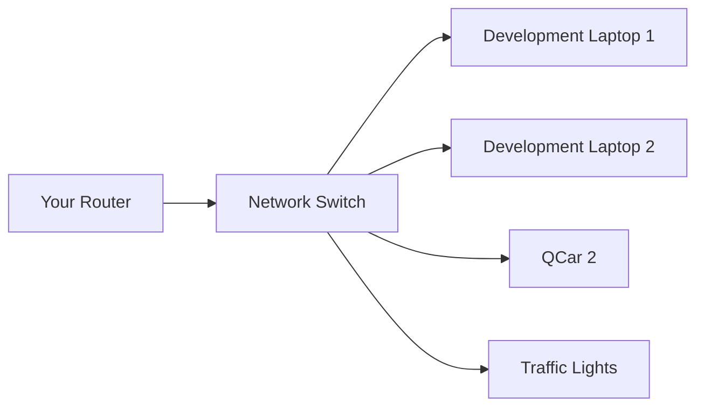

# Networking Guide

Reliable networking is **critical** for successful QCar 2 operation during the competition.

---

## ⚠️ Important Warning

> [!CAUTION]
> Not every competition venue has a reliable network. Past teams have had connectivity issues that resulted in **poor performance during their runs**.

**ALWAYS bring your own networking equipment!**

---

## 📦 Required Equipment

| Equipment | Purpose | Priority |
|-----------|---------|----------|
| **Router** | Create private network for QCar | 🔴 Critical |
| **Network Switch** | Connect multiple devices | 🔴 Critical |
| **Ethernet Cables** | Wired connections | 🟡 Recommended |

---

## 🔧 Setup Overview



### Advantages of Your Own Network

- **More reliable** connection
- **More secure** communication
- **Consistent** IP addresses
- **No interference** from venue traffic

---

## 📚 Official Documentation

### QCar 2 Connectivity
Follow the official [User Manual for Connectivity](https://github.com/quanser/Quanser_Academic_Resources/blob/dev-windows/3_user_manuals/qcar2/user_manual_connectivity.pdf) for:

- Initial connection setup
- Network configuration
- Troubleshooting common issues
- SSH access

---

## 🚦 Traffic Light Connection

Competition organizers may provide traffic lights for testing.

### Documentation
| Resource | Link |
|----------|------|
| **User Manual** | [Traffic Light Manual](https://github.com/quanser/Quanser_Academic_Resources/blob/dev-windows/3_user_manuals/traffic_light/user_manual_traffic_light.pdf) |
| **Example Code** | [GitHub Examples](https://github.com/quanser/Quanser_Academic_Resources/tree/dev-windows/5_research/sdcs/traffic_light) |

### Traffic Light IP
> [!NOTE]
> The competition organizer will provide the traffic light IP address at the venue.

---

## 💡 Best Practices

### Before Competition

1. **Test your network setup** at home/lab
2. **Practice connecting** to QCar 2
3. **Document your IP configuration**
4. **Prepare quick-connect scripts**

### At the Venue

1. **Set up networking first** before anything else
2. **Verify QCar connection** before practice
3. **Keep network equipment accessible** for troubleshooting
4. **Have backup configuration** ready

### During Competition

1. **Don't change network settings** mid-run
2. **Monitor connection stability**
3. **Have teammate watch network** if needed

---

## 🔧 Troubleshooting

### Common Issues

| Problem | Solution |
|---------|----------|
| QCar not responding | Check network cable connections |
| Can't find QCar on network | Verify IP address, check router DHCP |
| Intermittent disconnects | Use shorter ethernet cables, check interference |
| Slow response | Reduce network traffic, close unnecessary apps |

### Quick Fixes

```bash
# Ping QCar to check connectivity
ping <qcar_ip_address>

# Check your IP configuration
ipconfig  # Windows
ifconfig  # Linux

# SSH to QCar (if needed)
ssh user@<qcar_ip_address>
```

---

## 🔐 Security Notes

- Use **WPA2 or WPA3** encryption on your router
- Change **default router password**
- Use **private IP range** (e.g., 192.168.x.x)
- Disable **unnecessary services** on router

---

## 📋 Network Checklist

### Equipment
- [ ] Router (tested and working)
- [ ] Network switch (if needed)
- [ ] Ethernet cables (multiple lengths)
- [ ] Power adapters for network equipment

### Configuration
- [ ] Router configured with known SSID
- [ ] IP addresses documented
- [ ] QCar connection tested
- [ ] Traffic light connection tested

### Documentation
- [ ] IP configuration notes
- [ ] Quick-connect scripts saved
- [ ] Troubleshooting guide printed

---

## 🔗 Related Documents

- [[Checklist]] - Complete competition day checklist
- [[Physical-Stage-Guide]] - Physical stage rules
- [[QCar2-Overview]] - QCar 2 specifications

---

## 📚 External Resources

- [QCar 2 Connectivity Manual](https://github.com/quanser/Quanser_Academic_Resources/blob/dev-windows/3_user_manuals/qcar2/user_manual_connectivity.pdf)
- [Traffic Light Manual](https://github.com/quanser/Quanser_Academic_Resources/blob/dev-windows/3_user_manuals/traffic_light/user_manual_traffic_light.pdf)
- [Competition Day Guide](https://quanser.github.io/student-competitions/events/common/Rules_and_Objectives/Physical_Stage_Competition_Day_Guide.html)
